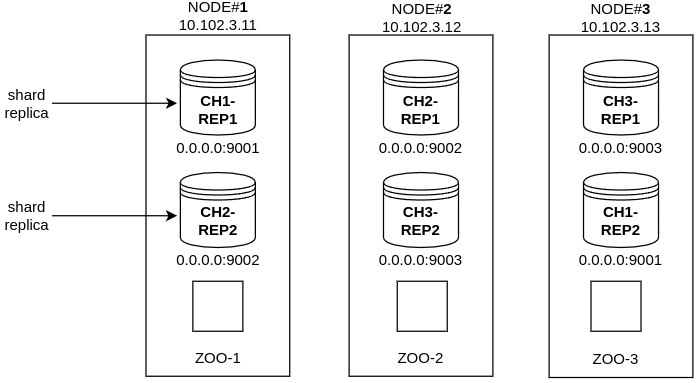

# Clickhouse Cluster with Ansible
## _Проект, позволяющий быстро развернуть тестовый кластер Clickhouse с репликацией через Zookeeper_ 
- Описание простой конфигурации в `.yaml`-файле с описанием shard-ов и реплик;
- Формирование всех необходимых переменных для playbook в dynamic inventory;
- Поднятие кластера Clickhouse при помощи Ansible.

 

## Конфигурация
Отредактируйте файл `config.yml` и добавьте туда описание своего кластера. Например:
```yml
1:
  - 10.102.3.11
  - 10.102.3.13
2:
  - 10.102.3.12
  - 10.102.3.11

3:
  - 10.102.3.13
  - 10.102.3.12
```
> Мы указываем, что **шард #1** будет расположен на нодах с IP-адресами: `10.102.3.11` и `10.102.3.13`;
> 
> **Шард #2** -  на нодах `10.102.3.12` и `10.102.3.11`;
> 
> **Шард #3** - на нодах `10.102.3.13` и `10.102.3.12`. 
>
>  Получается следующая структура:

